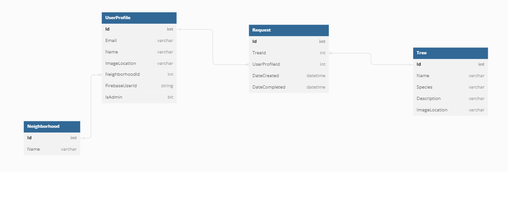

# Root Mt.Juliet

The non-profit group Root Nashville plants trees in Nashville neighborhoods, free of charge. Their vision is “to build a tree canopy for Nashville that creates more equitable, healthy, climate-resilient neighborhoods.” Root Nashville already has a working website and tree request from; however, I made one for my town, Mt. Juliet.

## Application Overview

Root Mt. Juliet is an application that allows the user to create a request for a tree to be planted in their neighborhood.

I built this application using React, C#, and Firebase. My goals were to create a full-stack web app and with different features based on the users authorization status in the backend. 

## Features

Users can create and edit their own profiles. 
Users can create a tree planting request and view all their own requests.
Admin users can see all user profiles.
Admin users can view all user requests and can mark requests as complete (edit requests).
Users can see a list of native trees with pictures and descriptions. These are the actual trees that Root Nashville plants.

## Demo

## Technologies Used

C#, SQL, javascript, react, reactstrap, postman, git, github, vscode, visual studio

## ERD

## Created by Brittany Mangum
 
